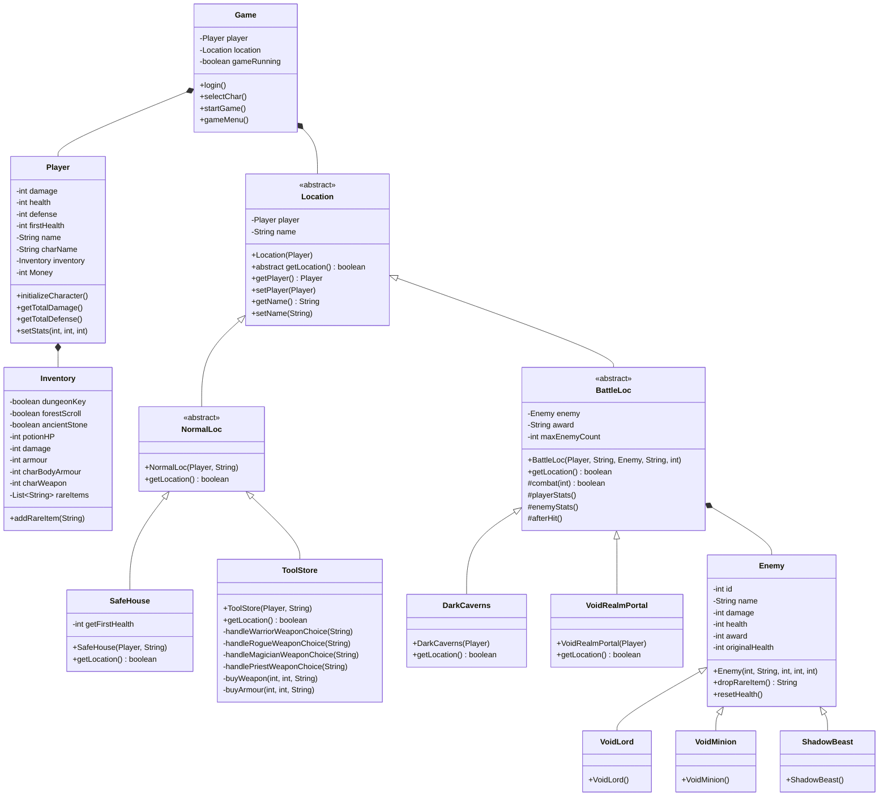

```mermaid
classDiagram
    %% Abstract classes
    class Location {
        <<abstract>>
        -Player player
        -String name
        +Location(Player)
        +abstract getLocation() boolean
        +getPlayer() Player
        +setPlayer(Player)
        +getName() String
        +setName(String)
    }

    class NormalLoc {
        <<abstract>>
        +NormalLoc(Player, String)
        +getLocation() boolean
    }

    class BattleLoc {
        <<abstract>>
        -Enemy enemy
        -String award
        -int maxEnemyCount
        +BattleLoc(Player, String, Enemy, String, int)
        +getLocation() boolean
        #combat(int) boolean
        #playerStats()
        #enemyStats()
        #afterHit()
    }

    %% Concrete classes
    class Game {
        -Player player
        -Location location
        -boolean gameRunning
        +login()
        +selectChar()
        +startGame()
        +gameMenu()
    }

    class Player {
        -int damage
        -int health
        -int defense
        -int firstHealth
        -String name
        -String charName
        -Inventory inventory
        -int Money
        +initializeCharacter()
        +getTotalDamage()
        +getTotalDefense()
        +setStats(int, int, int)
    }

    class Enemy {
        -int id
        -String name
        -int damage
        -int health
        -int award
        -int originalHealth
        +Enemy(int, String, int, int, int)
        +dropRareItem() String
        +resetHealth()
    }

    class Inventory {
        -boolean dungeonKey
        -boolean forestScroll
        -boolean ancientStone
        -int potionHP
        -int damage
        -int armour
        -int charBodyArmour
        -int charWeapon
        -List~String~ rareItems
        +addRareItem(String)
    }

    %% Location implementations
    class SafeHouse {
        -int getFirstHealth
        +SafeHouse(Player, String)
        +getLocation() boolean
    }

    class ToolStore {
        +ToolStore(Player, String)
        +getLocation() boolean
        -handleWarriorWeaponChoice(String)
        -handleRogueWeaponChoice(String)
        -handleMagicianWeaponChoice(String)
        -handlePriestWeaponChoice(String)
        -buyWeapon(int, int, String)
        -buyArmour(int, int, String)
    }

    class DarkCaverns {
        +DarkCaverns(Player)
        +getLocation() boolean
    }

    class VoidRealmPortal {
        +VoidRealmPortal(Player)
        +getLocation() boolean
    }

    %% Enemy types
    class VoidLord {
        +VoidLord()
    }

    class VoidMinion {
        +VoidMinion()
    }

    class ShadowBeast {
        +ShadowBeast()
    }

    %% Relationships
    Location <|-- NormalLoc
    Location <|-- BattleLoc
    NormalLoc <|-- SafeHouse
    NormalLoc <|-- ToolStore
    BattleLoc <|-- DarkCaverns
    BattleLoc <|-- VoidRealmPortal
    Enemy <|-- VoidLord
    Enemy <|-- VoidMinion
    Enemy <|-- ShadowBeast
    Game *-- Player
    Game *-- Location
    Player *-- Inventory
    BattleLoc *-- Enemy
``` 